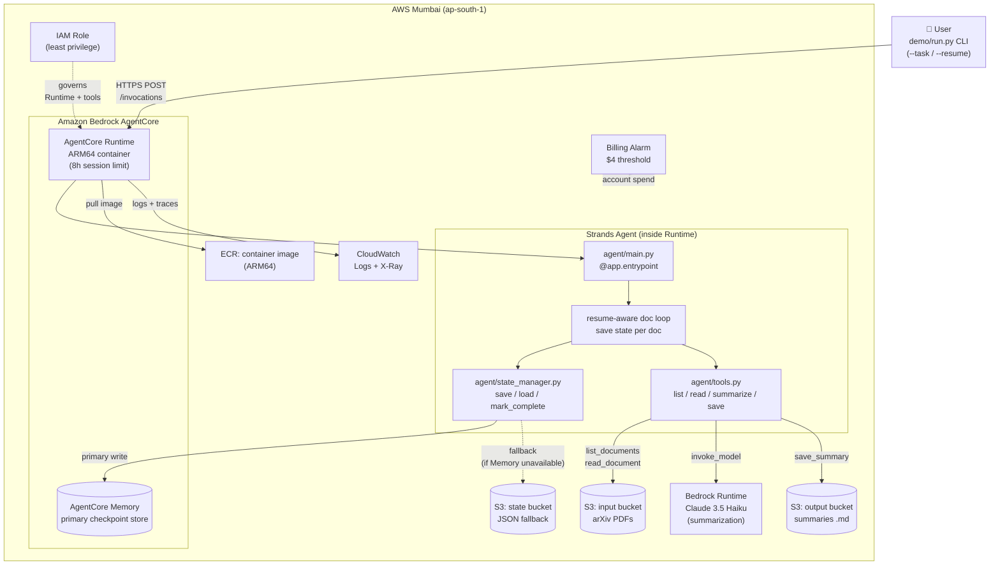

# Architecture

## Diagram



## Resilience flow

1. Loop reads document `i` → calls Bedrock → writes summary to S3.
2. **Immediately** writes a checkpoint `{task_id, completed_idx: i, results: [...]}` to AgentCore Memory.
3. If the process dies (timeout, OOM, kill, network fault), the checkpoint survives outside the container.
4. On restart, `load_progress(task_id)` returns `completed_idx: i`; the loop resumes at `i+1`.
5. No document is processed twice. No work is lost.

## Architecture decisions

### 1. Primary state = AgentCore Memory; fallback = S3 JSON

The state manager writes to Memory first. On any client error, the same payload writes to `s3://{state_bucket}/checkpoints/{task_id}.json`. Loads try Memory first and fall back to S3.

This protects against:
- A regional Memory outage
- Service-quota surprises during long runs
- API surface changes between SDK versions (S3 is rock-solid)

### 2. Checkpoint after every document

Memory writes cost roughly $0.0001 each. Re-running one Bedrock summarization costs roughly $0.005. Checkpoint frequency converges on "after every expensive operation" — there is no reason to batch.

### 3. Schema versioning

Every checkpoint carries `schema_version: 1`. If the structure ever changes:
- `load_progress` detects the mismatch
- Logs a warning
- Returns `None` so the agent starts fresh rather than crashing on a malformed payload

To migrate, bump `SCHEMA_VERSION` in `agent/state_manager.py` and add a migration function (out of scope for v0.1).

### 4. Tools run in-process inside the Runtime container

Lambda was the alternative. Lambda would have added cold-start latency and a second IAM role for no benefit at 100-document scale. In-process tools are simpler and cheaper.

### 5. Deterministic loop, not LLM-driven tool selection

Strands' `Agent` class can drive a reasoning loop where the LLM picks tools. We do not use that here. Our loop is `for doc in keys: read; summarize; save; checkpoint` — fully deterministic. The LLM is invoked only inside `summarize_text`. This gives:
- Predictable cost per document
- Easy resume semantics (just an index)
- Trivial testability with fake tools

### 6. PDF text extraction via `pypdf`

arXiv PDFs are well-formed; no OCR is required. `pypdf >= 4.0` is fast, has no native dependencies, and ships pure Python wheels.

### 7. Local-dev friendly

Unit tests use `moto` to mock S3 in-process. They never call real AWS. The state manager's File backend is the test default, so no Memory or S3 setup is required for the test suite.

## Schema

A checkpoint payload looks like this:

```json
{
  "schema_version": 1,
  "task_id": "task-001",
  "completed_idx": 47,
  "results": [
    {
      "doc_idx": 0,
      "doc_key": "papers/2401.12345.pdf",
      "summary_key": "summaries/task-001/papers/2401.12345.pdf.md",
      "summary_preview": "First 200 chars of the summary...",
      "completed_at": "2026-05-06T03:14:15+00:00"
    }
  ],
  "status": "in_progress",
  "started_at": "2026-05-06T03:14:00+00:00",
  "updated_at": "2026-05-06T04:00:00+00:00"
}
```

`status` flips to `complete` only briefly — `mark_complete` deletes the checkpoint outright, so a finished task leaves no trace.

## Failure modes considered

| Failure | Detection | Recovery |
|---|---|---|
| AgentCore Runtime container killed (OOM, manual kill, network) | next invocation sees prior checkpoint | resumes at `completed_idx + 1` |
| Lambda 15-min timeout | n/a — this is on AgentCore Runtime, 8h limit | resumes at `completed_idx + 1` |
| AgentCore Memory write fails | StateManager catches, falls back to S3 | next read finds state in S3 |
| Both Memory and S3 fail | StateManager raises after every backend errors | loop crashes loudly; user investigates |
| Schema version mismatch | `load_progress` checks `schema_version`, returns None | task starts fresh; user gets a warning |
| Bedrock throttling | tool raises ClientError, propagates up the loop | checkpoint is from the last *successful* doc; resume there |
| One PDF is corrupt | `read_document` raises RuntimeError, propagates | checkpoint preserved; user must skip or fix that doc manually |
| Concurrent runs of the same task_id | last write wins (no locking) | both runs converge but may duplicate one or two docs — out of scope for v0.1 |

## Future work

See [Lessons learned / What's next](../blog/post.md#whats-next).
